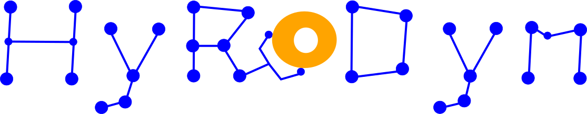
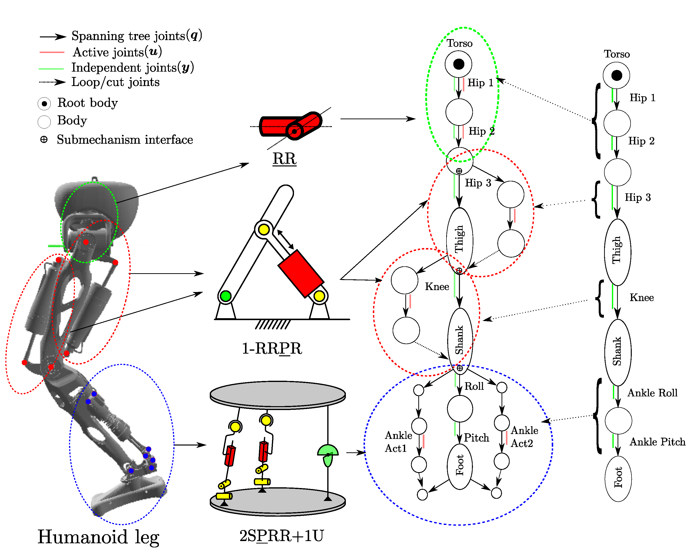
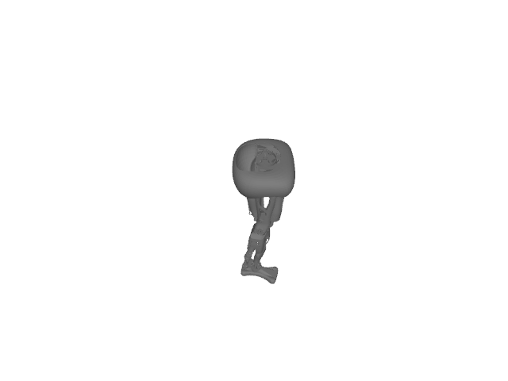

# Hybrid Robot Dynamics
[](https://git.hb.dfki.de/hyrodyn/hyrodyn/-/pipelines)


## ✳️ Overview
Hybrid Robot Dynamics (HyRoDyn) is a kinematics and dynamics solver for series-parallel hybrid robots. 
It exploits the modularity in robot design and can help you solve kinematics and dynamics of such systems analytically. 

<p align="center">
  
</p>

<p align="center">
  
  
</p>

## ✨ Features

- Analytical kinematics and dynamics for hybrid robots
- Support for series–parallel mechanisms
- Modular robot architecture representation
- Efficient rigid-body dynamics computation
- C++ core with optional Python bindings
- Compatible with URDF robot descriptions

## 📦 Requirements

### C++ Build

- CMake ≥ 3.10
- C++17 compatible compiler
- Eigen3
- yaml-cpp
- Boost (all components)
- TinyXML
- GoogleTest (for unit tests)

### Python Bindings (Optional)

- Python ≥ 3.8
- pybind11
- Python development headers


## 🔧 Build Instructions

### Linux

#### 1. Update System

```bash
sudo apt update
sudo apt upgrade
```

#### 2. Install Required System Dependencies

```bash
sudo apt install -y --no-install-recommends \
    build-essential \
    cmake \
    git \
    ca-certificates \
    libeigen3-dev \
    libyaml-cpp-dev \
    libboost-all-dev \
    libtinyxml-dev \
    libgtest-dev
```

##### Optional (recommended for advanced CMake configuration):

```bash
sudo apt install cmake-curses-gui
```

##### Optional: install clang

```bash
sudo apt install clang
```

#### 3. Install Python Dependencies (Optional – for Python bindings)

```bash
sudo apt install -y python3-dev python3-pybind11
```

## 🔧 Build HyRoDyn

### 1. Clone the Repository

```bash
git clone --recursive git@git.hb.dfki.de:hyrodyn/hyrodyn.git
cd hyrodyn
```

If already cloned without `--recursive`:

```bash
git submodule update --init --recursive
```

### 2. Compile

```bash
mkdir build && cd build
cmake -DCMAKE_BUILD_TYPE=Release ..
make -j
```

### 3. Build with Python Bindings

To build HyRoDyn with Python bindings, please follow the instructions in the [Python bindings section](python/README.md).

## 🚀 Usage & Examples

> **Note:** HyRoDyn requires both a URDF file and a submechanisms YAML file to define the modular robot structure.
> Example files for the provided robots are in `robot/<robot_name>/urdf/` (e.g. [`robot/leg/urdf/`](robot/leg/urdf/)).

### Quick start (C++)

```cpp
#include "robot_model_hyrodyn.hpp"

hyrodyn::RobotModel_HyRoDyn robot;
robot.load_robotmodel("robot/leg/urdf/leg.urdf",
                      "robot/leg/urdf/submechanisms.yml");

robot.y = Eigen::VectorXd::Zero(robot.jointnames_independent.size());
robot.calculate_system_state();            // populate Q, u, …
robot.calculate_forward_kinematics("LLAnklePitch_Link");
// robot.pose → [x, y, z, qx, qy, qz, qw]
```

See [src/Main.cpp](src/Main.cpp) for a runnable example.

### Quick start (Python)

```python
import hyrodyn, numpy as np

robot = hyrodyn.RobotModel("robot/leg/urdf/leg.urdf",
                           "robot/leg/urdf/submechanisms.yml")
robot.y = np.zeros(robot.independent_dof)
robot.calculate_system_state()
robot.calculate_forward_kinematics("LLAnklePitch_Link")
print(robot.pose)  # [x, y, z, qx, qy, qz, qw]
```

### Detailed tutorials

Step-by-step tutorials for C++ and Python (forward/inverse kinematics, inverse dynamics, mass-inertia matrix, CoM) are in [docs/tutorials.md](docs/tutorials.md).

For the full Python tutorial script run:

```bash
python python/scripts/tutorial_hyrodyn.py
```

See [python/README.md](python/README.md) for Python bindings setup.

## 📁 Folder Structure

1. **addons/**: Contains an internal URDF parser used to construct modular robot models.
2. **bin/**: Utility scripts used to generate custom submechanism libraries.
3. **external/**: Third-party libraries used by HyRoDyn. Currently includes RBDL, which provides the rigid-body dynamics primitives.
4. **python/**: Optional Python bindings implemented using pybind11.
5. **robot/**: Example robots including:
   - URDF robot descriptions
   - YAML files defining submechanisms
6. **src/**: Main source code implementing HyRoDyn algorithms for solving the kinematics and dynamics of hybrid robots, including handling closed-loop mechanisms analytically or numerically.
7. **docs/**: Documentation generated using Doxygen. The configuration file (`Doxyfile`) is provided to generate the API documentation for the project.

## 🧪 Testing

HyRoDyn uses [GoogleTest](https://github.com/google/googletest). Tests live in [`test/test_hyrodyn.cpp`](test/test_hyrodyn.cpp).

### Run all tests

```bash
cd build
ctest --output-on-failure
```

Or run the binary directly from the **repository root** (required so that robot file paths resolve correctly):

```bash
./build/hyrodyn_tests
```

### Add a new test

1. Open [`test/test_hyrodyn.cpp`](test/test_hyrodyn.cpp).
2. Add a `TEST(Hyrodyn, MyNewTest)` block using GoogleTest's `ASSERT_*` / `EXPECT_*` macros.
3. Rebuild and rerun: `make -j -C build && ctest --output-on-failure -C build`.

See [CONTRIBUTING.md](CONTRIBUTING.md#testing) for the full test contribution guidelines.

---

## 📖 API Documentation

API documentation is generated from the header files using [Doxygen](https://www.doxygen.nl/).

```bash
# From the repository root
doxygen Doxyfile
```

HTML output is written to `docs/html/`. Open `docs/html/index.html` in a browser.

The main public API is documented in:
- [`src/HyRoDyn.hpp`](src/HyRoDyn.hpp) — low-level functional API (all algorithms).
- [`src/robot_model_hyrodyn.hpp`](src/robot_model_hyrodyn.hpp) — high-level `RobotModel_HyRoDyn` class.

---

## 📜 License
HyRoDyn is distributed under the [3-clause BSD license](https://opensource.org/licenses/BSD-3-Clause). See the [LICENSE](LICENSE) file for more details.

## 📚 Citation

If you use **analytical** approach from HyRoDyn in research, please cite:
```
@inproceedings{2019_Kumar_HyRoDynApproach_IDETC,
author={Kumar, Shivesh
and Mueller, Andreas},
title={An Analytical and Modular Software Workbench for Solving Kinematics and Dynamics of Series Parallel Hybrid Robots},
Booktitle = {ASME 2019 International Design Engineering Technical Conferences and Computers and Information in Engineering Conference},
Series = {43rd Mechanisms and Robotics Conference},
}
```
If you use **numerical** approach from hyrodyn, please cite:
```
@INPROCEEDINGS{hyrodyn_GCP,
  author={Kumar, Rohit and Kumar, Shivesh and Müller, Andreas and Kirchner, Frank},
  booktitle={2022 IEEE/RSJ International Conference on Intelligent Robots and Systems (IROS)}, 
  title={Modular and Hybrid Numerical-Analytical Approach - A Case Study on Improving Computational Efficiency for Series-Parallel Hybrid Robots}, 
  year={2022},
  doi={10.1109/IROS47612.2022.9981474}}
```

## 🎉  Acknowledgements

This project would not be possible without the contributions of the following repositories:

- [urdfreader](https://github.com/ORB-HD/URDF_Parser): Internal URDF parser used to construct robot models.
- [rbdl](https://github.com/rbdl/rbdl): provides rigid-body dynamics primitives.


## 📧 Contact Information:
For further questions or collaboration inquiries, please contact the developers at:
- [Rohit Kumar](mailto:r.kumar@dfki.de)

Copyright 2026, DFKI GmbH / Robotics Innovation Center
